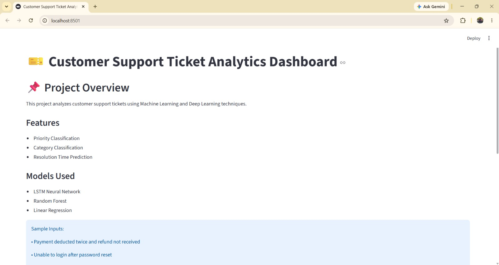
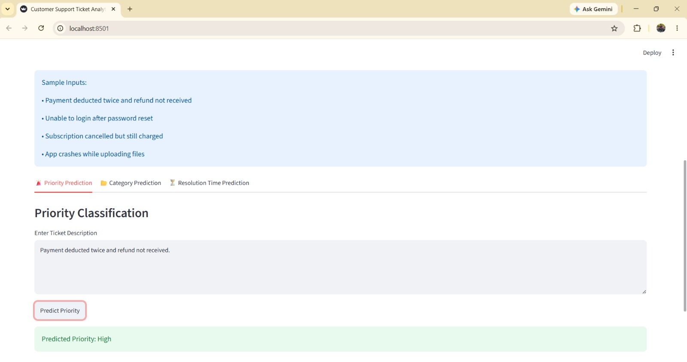
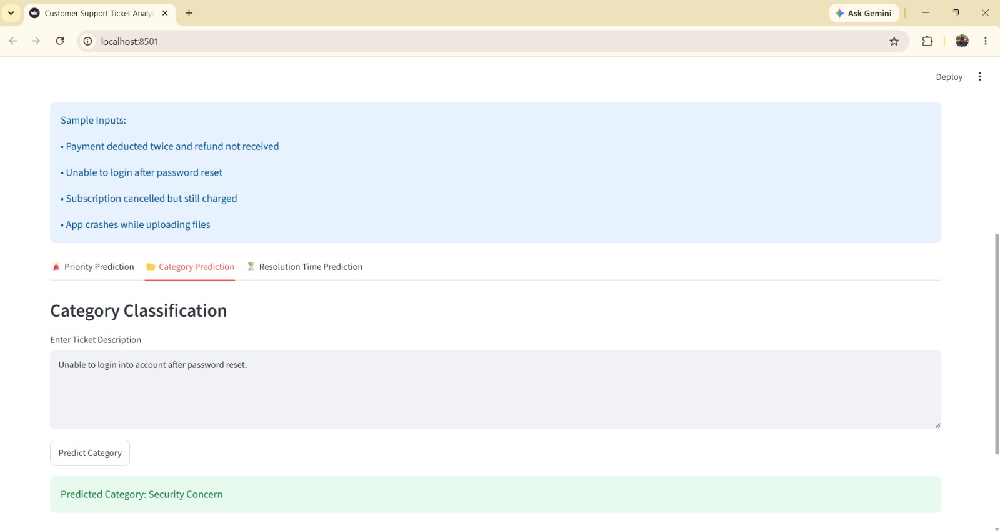
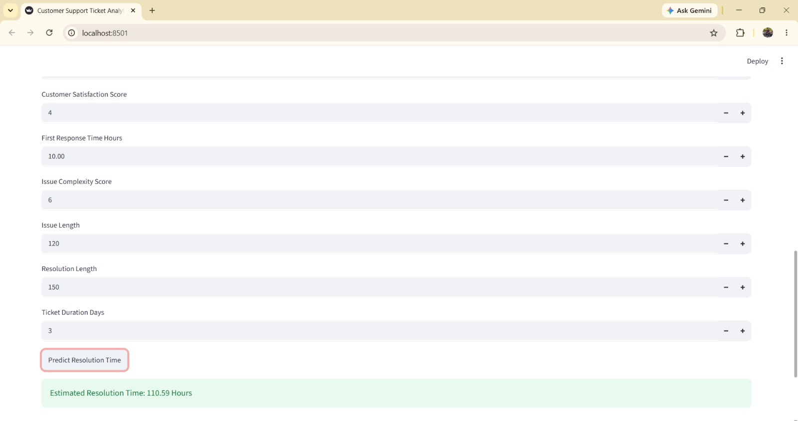

# 🎫 Customer Support Ticket Analytics Dashboard

## 📌 Project Overview

This project analyzes customer support tickets using Machine Learning and Deep Learning techniques.

The system can:

* Predict Ticket Priority
* Predict Ticket Category
* Predict Resolution Time

An interactive Streamlit dashboard allows users to enter ticket details and receive instant predictions.

---

## 🎯 Business Objective

Customer support teams receive thousands of tickets every day.

This project helps automate ticket management by:

* Identifying ticket priority
* Categorizing support issues
* Estimating resolution time

This enables faster response and better resource allocation.

---

## 📊 Dataset Information

Dataset Size: 200,000 Records

Features include:

* Customer Age
* Customer Tenure
* Previous Tickets
* Customer Satisfaction Score
* First Response Time
* Issue Complexity Score
* Issue Description
* Resolution Notes
* Resolution Time Hours

---

## 🧹 Data Preprocessing

* Missing Value Handling
* Feature Engineering
* Text Combination
* Label Encoding
* Train-Test Split
* TF-IDF Vectorization
* Tokenization and Padding

---

## 🤖 Models Used

### Priority Classification

Traditional ML:

* Logistic Regression
* Random Forest

Deep Learning:

* LSTM Neural Network

---

### Category Classification

Traditional ML:

* Logistic Regression
* Random Forest

Deep Learning:

* LSTM Neural Network

---

### Resolution Time Prediction

Regression Models:

* Linear Regression
* Random Forest Regressor

---

## 📈 Results

### Priority Classification

| Model               | Accuracy |
| ------------------- | -------- |
| Logistic Regression | 25.30%   |
| Random Forest       | 24.76%   |
| LSTM                | 25.07%   |

---

### Category Classification

| Model               | Accuracy |
| ------------------- | -------- |
| Logistic Regression | 10.04%   |
| Random Forest       | 9.81%    |
| LSTM                | 10.08%   |

---

### Resolution Time Prediction

| Model             | MAE   |
| ----------------- | ----- |
| Linear Regression | 59.80 |
| Random Forest     | 60.28 |

---

## 🌐 Streamlit Dashboard Features

### Priority Prediction

Predicts:

* Low
* Medium
* High
* Urgent

---

### Category Prediction

Predicts:

* Login Issue
* Payment Problem
* Refund Request
* Security Concern
* Bug Report
* Feature Request
* Performance Issue
* Subscription Cancellation
* Data Sync Issue
* Account Suspension

---

### Resolution Time Prediction

Predicts estimated ticket resolution time in hours.

---

## 🖼️ Screenshots

| App Home | Priority Prediction |
|---|---|
|  |  |

| Category Prediction | Resolution Time Prediction |
|---|---|
|  |  |

---

## 🛠️ Technologies Used

* Python
* Pandas
* NumPy
* Scikit-learn
* TensorFlow
* Keras
* Streamlit
* Matplotlib
* Seaborn

---

## 📂 Project Structure

```
customer-support-ticket-analytics/
├── models/
├── docs/
├── screenshots/
├── 01_eda.ipynb
├── 02_priority_classification.ipynb
├── 03_category_classification.ipynb
├── 04_resolution_time_hours.ipynb
├── 05_streamlit_preparation.ipynb
├── app.py
├── requirements.txt
└── README.md
```

---

## 🚀 Run Project

Create Environment:

```
python -m venv tf_env
```

Activate Environment:

```
tf_env\Scripts\activate
```

Install Dependencies:

```
pip install -r requirements.txt
```

Run Streamlit App:

```
streamlit run app.py
```

---

## Important Note

Due to GitHub file size limitations, some trained model files and datasets are not included in this repository:

* **`models/resolution_time_rf.pkl`** (~1.4 GB) — exceeds GitHub's 100MB file limit. Regenerate it by running `04_resolution_time_hours.ipynb`.
* **`Data/customer_support_ticket.xlsx`** and **`Data/final_customer_support.csv`** — exceed GitHub's web-upload limits. The raw dataset can be sourced from the original customer support ticket dataset; `final_customer_support.csv` is regenerated by running `01_eda.ipynb`.

To run the project successfully, place these files inside the appropriate folders:

### Models Folder

* priority_lstm.keras
* priority_category_lstm.keras
* resolution_time_rf.pkl
* priority_tokenizer.pkl
* priority_encoder.pkl
* category_tokenizer.pkl
* category_encoder.pkl

### Dataset Folder

* customer_support_ticket.xlsx
* final_customer_support.csv

All code, notebooks, preprocessing steps, training workflow, and Streamlit application are included in this repository.

## 👨‍💻 Author

Thaheer
